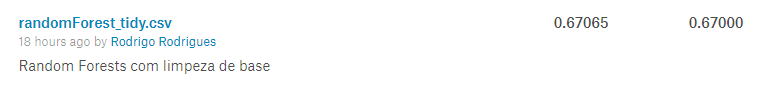

# Introdução 

Esse projeto baseia-se na competição [New York City Taxi Trip Duration](https://www.kaggle.com/c/nyc-taxi-trip-duration) do [Kaggle](https://www.kaggle.com).
O objetivo é obter um modelo preditivo para o tempo de viagem em um taxi na cidade de Manhattan, a partir do local de embarque e o destino, a hora de embarque e detalhes não reconhecíveis do veículo e passageiros (empresa de taxi, se a viagem está sendo gravada para análise, numero de passageiros).
Para isso é fornecido um arquivo de treino com 1.458.644 observações e um de teste com 625.134 observações, não são fornecidos os resultados do arquivo de teste mas é disponibilizada uma ferramenta para calculo do erro médio quadrado das predições e essa foi a métrica utilizada para comparação dos modelos (Quanto menor melhor).

# Instalação de bibliotecas

Para execução desse projeto são necessárias algumas bibliotecas, para facilitar a importação e instalação (quando necessário) utilizamos a seguinte função:

```{r installfunction, cache=FALSE}
installLibs <- function(x){
  for( i in x ){
    if( ! require( i , character.only = TRUE ) ){
      install.packages( i , dependencies = TRUE )
      require( i , character.only = TRUE )
    }
  }
}
```

Para execução utilizamos as seguintes bibliotecas:

```{r installlibs, cache=FALSE, results=FALSE, warning=FALSE}
installLibs(c('readr','dplyr','lubridate','ggplot2','data.table','tidyverse','randomForest'))
```

# Preparação dos dados

Os dados não estão em um formato ideal para análise, foi necessário realizar uma limpeza e transformações na base para poder alimentar os modelos.
Por uma questão de espaço não demostraremos aqui a comparação entre os modelos com os dados originais e os tratados mas em todos os modelos houveram melhoras na predição após transformar os dados.

## Importação dos arquivos

Primeiramente descompactamos os arquivos baixados do Kaggle para a pasta datasets e carregamos os arquivos:

```{r unzip, cache=TRUE, warning=FALSE, message=FALSE}
unzip(zipfile = 'datasets/test.zip',exdir = 'datasets')
unzip(zipfile = 'datasets/train.zip',exdir = 'datasets')
train.original <- read_csv("datasets/train.csv")
test.original <- read_csv("datasets/test.csv")
head(train.original)
```
## Transformações

Removemos dados que consideramos erros na coleta por serem muito maiores do que o esperado:

### Duração de viagem

Ao analisar a distribuiçãodas variáveis de resultado percebemos que existem alguns outliers muito acima do esperado:

```{r histtimeoriginal, cache=TRUE}
hist(train.original$trip_duration,breaks=240)
```

Consideramos que viagens acima de 2 horas dentro da cidade indicam um erro e removemos esses itens da base de treino 
```{r histduracaoLimpa, cache=TRUE}
train.original <- train.original[train.original$trip_duration<=60*60*2,]
hist(train.original$trip_duration, breaks = 240)
```


### Distância entre coordenadas

Recebemos a distância em coordenadas geográficas para corrigir a distância euclidiana entre os pontos definimos uma função que converte a diferença os graus para radianos e multiplica pelo raio da terra (de acordo com a fórmula de área de perimetro do circulo 2*\pi*r)

```{r distanciaCoordenadas, cache=TRUE}
# Converte graus para rads para usar as funções matemáticas
# (Cordenadas são em graus)
grausParaRadianos <- function(graus){
  graus * (pi/180)
}

#calcula distancia em graus e converte para metros
distanciaEuclidiana <- function(coords){
  lat1 <- coords[1]
  long1 <- coords[2]
  lat2 <- coords[3]
  long2 <- coords[4]
  x <- lat2 - lat1
  y <- long2 - long1
  h <- sqrt(x*x+y*y)
  r <- 6371000 #raio da terra em m
  rad <- grausParaRadianos(h)
  d<- rad*r
  d
} 
```

### Distância de Manhattan 29º

Como estamos trabalhando especificamente com a cidade de Manhattan é mais preciso utilizar a distância de Manhattan do que a euclidiana,o único fator de dificuldade para essa operação é que a cidade de manhattan tem uma rotação de 29º em relação ao norte geográfico e por isso precisamos aplicar uma matriz de transformação nas coordenadas do mapa, no caso rotacionamos o destido em relação à origem da viagem:

$$
\left(\begin{array}{cc} 
x'\\
y'
\end{array}\right)
=
\left(\begin{array}{cc} 
cos \phi & sin \phi\\
-sin\phi & cos\phi
\end{array}\right)
\left(\begin{array}{cc} 
x\\ 
y
\end{array}\right)
$$ 

```{r distanciaManhattan}

distanciaManhatan <- function(coords){
  lat1 <- coords[1]
  long1 <- coords[2]
  lat2 <- coords[3]
  long2 <- coords[4]
  d1 <- distanciaEuclidiana(c(lat1,0,lat2,0))
  d2 <- distanciaEuclidiana(c(0,long1,0,long2))
  d <- d1+d2
  d
}

# a cidade de manhatan tem uma inclinação de 29º em relação ao norte
rotacionaCoordenadas <- function(coords){
  lat1 <- coords[1]
  long1 <- coords[2]
  lat2 <- coords[3]
  long2 <- coords[4]
  x1 <- lat2 - lat1
  y1 <- long2 - long1
  angulo <- grausParaRadianos(29)
  x2 <- x1 * cos(angulo) - y1 * sin(angulo)
  y2 <- x1 * sin(angulo) + y1 * cos(angulo)

  x <- x2 + lat1
  y <- y2 + long1
  
  c(lat1,long1,x,y)
}

#calcula a distancia utilizando a distancida de manhattan com cordenadas rotacionas em 29º
distancia <- function(lat1, long1, lat2, long2){
  d <- rep(0,length(lat1))
  for(i in 1:length(lat1)){
    
    a <- c(lat1[i],long1[i],lat2[i],long2[i])
    
    d[i] <- rotacionaCoordenadas(a) %>% distanciaManhatan
  }
  d
}

```

### Estimativa de trânsito

Como não temos uma fonte de dados que indique o trânsito, estimamos um fator de transito de acordo com o horário pela distribuição dos embarques:

```{r plotDistHour, warning=FALSE, message=FALSE}
#plot feito com um sample por questão de melhor visualização e tempo de processamento
sample <- train.original %>% mutate(pickup_hour = hour(ymd_hms(pickup_datetime))) %>% sample_n(10000)
ggplot(sample, aes(x = pickup_hour, y = log(trip_duration))) + geom_point(position = "jitter", alpha = 0.25) + geom_smooth() +labs(x = "Hour of Pickup", y = "Log of Trip Duration", title = "Trip Duration by Pickup Hour")
```

Realizamos uma agregação particionando por hora para termos uma variável que represente uma escala do volume esperado de embarques no periodo e assim podemos identificar os horários de alta e baixa demanda:

```{r histHora, cache=T}
#analisa horários de pico
rush <- hour(train.original$pickup_datetime)
rush.hist <- hist(rush,  breaks = 23, plot = FALSE)
rush.mean <- mean(rush.hist$counts) #media
rush.sd <- sd(rush.hist$counts) #desvio padrão
hcol <- rep('orange',24) #padrão laranja (transito moderado)
hcol[rush.hist$counts<rush.mean] <- 'green' #transito abaixo da média
hcol[rush.hist$counts>rush.mean+rush.sd] <- 'red' #transito Intenso (media + desvio padrão)
hist(rush,  breaks = 23, plot = TRUE, freq = TRUE,main = 'Histograma dos horários (Rush)', xlab = 'Hora', ylab='Viagens', col = hcol)
abline(rush.mean,0, lty=2)
abline(rush.mean+rush.sd,0, col='red', lty=2)

```

### Aplicando Transformações

Aplicamos as tranformações nos datasets e trocamos as coordenadas pela distância estimada e os horários pelo indicador de demanda de embarque:

```{r transmute, cache=T}
# Calculando distâncias, limpando dados e classificando horários de pico. Essa operação pode demorar alguns minutos

train <- transmute(train.original, id, vendor_id, passenger_count, recording=store_and_fwd_flag=='Y',
       distance = distancia(pickup_latitude,pickup_longitude,dropoff_latitude, dropoff_longitude), 
       traffic=ifelse(is.na(pickup_datetime),rush.mean,rush.hist$counts[hour(pickup_datetime)]) , trip_duration)

# Fazendo o mesmo para a base de teste

test <- transmute(test.original, id, vendor_id, passenger_count, recording=store_and_fwd_flag=='Y',
                  distance = distancia(pickup_latitude,pickup_longitude,dropoff_latitude, dropoff_longitude), 
                  traffic=ifelse(is.na(pickup_datetime),rush.mean,rush.hist$counts[hour(pickup_datetime)]))

head(train)
```

### Limpeza de outliers
Similar ao problema da duração de viagem temos um problema com distância muito grandes:

```{r histDists, cache=T}
hist(train$distance)
```

Removemos distâncias muito maiores do que o esperado utilizando a distância interquartil com fator 1.5:

```{r distOutliers, cache=T}
qnt <- quantile(train$distance, probs=c(.25, .75))
H <- 1.5 * IQR(train$distance)
dist <- train$distance
train<- train[dist <= (qnt[2] + H),]

hist(train$distance)
```

# Desenvolvimento de modelos

Para a resolução do problema utilizamos 3 modelos diferentes apresentados aqui por ordem de efetividade.

## KMeans

```{r kmeans, cache=TRUE}
#para reproducibilidade
set.seed(20)

#cria o cluster
NYCTripCluster <- kmeans(train[, 2:6], 2, nstart = 20)

#Criando a tabela para visualizar o resultado do Cluster com Kmeans

base::table(NYCTripCluster$cluster,train$recording)

#Preparando os dados para montar os modelos e calcular a distancia manhattan
```

## Random Forest

Obtivemos um bom resultado com Ntree = 100:


```{r randomForest}
#Criando um modelo com randomForest com ntree = 100 
#rf_trip_duration <- randomForest(trip_duration ~ vendor_id + passenger_count + recording + distance + traffic ,data = train,ntree = 100)

#fazendo a predição do modelo para trip_duration
#rf_prediction <- predict(rf_trip_duration, test, type = "response") 

#Preparando o arquivo de submissão em dataframe com a predição com id e trip_duration
#submission_file <- data.frame(id = test$id, trip_duration = rf_prediction)

#Escrevendo o arquivo.csv para a submissão
#write.csv(submission_file, "randomForest_tidy.csv", row.names=F)
```

após enviar o arquivo para testes no Kaggle obtivemos um erro quadrado médio de 0.67000


## Rede Neural

Utilizando uma rede neural obtivemos o melhor resultado entre os modelos, mas devido ao volume de dados não incluimos nesse arquivo o treinamento da rede completa, a execução desse código pode levar várias horas por isso realizamos com aproximadamente 1% dos dados:

```{r neuralnet, cache=TRUE}

#set.seed(500)
#head(train)
#t<-train[,c(3,5,7)]

#cor(t)
#t <- t[sample(1:nrow(t),13000),]

#model <- train(trip_duration ~  passenger_count + distance , t, method='nnet', linout=TRUE, trace = FALSE)
#ps <- predict(model, test)
#ps
#plot(ps)

#Preparando o arquivo de submissão em dataframe com a predição com id e trip_duration

#submission_file <- data.frame(id = test$id, trip_duration = ps)

#Escrevendo o arquivo.csv para a submissão

#write.csv(submission_file, "randomNeuralNetsCaretSample.csv", row.names=F)
```

Com esse volume de dados obtivemos a acurácia de X

Utilizando 10 % dos dados obtivemos a acurácia de Y

# Conclusão